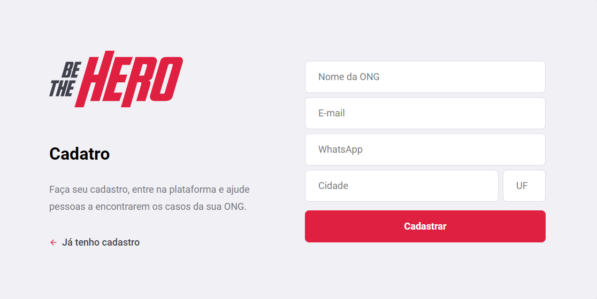
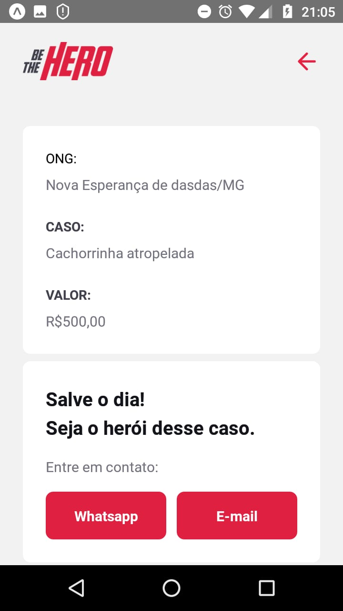

<h1 align="center"></h1>

## :bookmark: Table of contents
- [About the Project](#clipboard-about-the-project)
- [Built With](#hammer-built-with)
- [Getting Started](#rocket-getting-started)
  - [Prerequisites](#heavy_check_mark-prerequisites)
  - [Installation](#gear-installation)
- [Usage](#computer-usage)
- [License](#information_source-license)
- [Contact](#email-contact)
- [Acknowledgements](#purple_heart-acknowledgments)

## :clipboard: About the Project
   <p align="justify">NGOs (Non Governamental Organizations) exist all over the World. With different occupation areas, they serve a vital purpose in modern society, helping with noble causes 
without putting profit first. Problem is, may of those organizations do not have the financial resources required in order to exercise their duty, depending on donations to fullfill their missions.<br /><br />
   That's where Be the Hero comes in, functioning as a bridge between the NGOs in need of resources and the people (heroes) determined to help with their own money and/or kind words, providing detailed descriptions of cases and ways to help them.</p>
   
## :hammer: Built With
  - [NodeJS](https://nodejs.org/en/)
  - [ReactJS](https://reactjs.org/)
  - [React Native](https://reactnative.dev/)
  - [Expo](https://expo.io/)
  - [SQLite](https://www.sqlite.org/index.html)
  
## :rocket: Getting Started
Be the Hero is **NOT** a commercial application. The project was developed exclusively with educational intentions and, as such, haven't been published. With that im mind, if you want to run a local instance of the program for testing and curiosity purposes, please follow these steps:
### :heavy_check_mark: Prerequisites
All of those must be installed before you try to run the project:
  - [NodeJS](https://nodejs.org/en/download/)
  - [NPM](https://www.npmjs.com/get-npm) - *Auto installed with NodeJS*
  - [Expo](https://expo.io/) - **Must also be installed in your cellphone**
### :gear: Installation
After cloning or downloading the project in your local machine, navigate to `Mobile\src\services\api.js` and change the *baseURL* variable to your respective IP. Once this is done, open the project's folder in your terminal and run the following commands:
  ```bash
  # Go to Backend folder
  $ cd Backend
  
  # Install all necessary dependencies
  $ npm install
  
  # Run the server
  $ npm start
  ```
The server will start at port :3333. **Open another terminal and leave this one open**.
  ```bash
  # Go to Frontend folder
  $ cd Frontend
  
  # Install all necessary dependencies
  $ npm install
  
  # Run the application
  $ npm start
  ```
Wait a moment and the application will open at port :3000. **Open another terminal and leave this one open**.
  ```bash
  # Go to Mobile folder
  $ cd Mobile
  
  # Install all necessary dependencies
  $ npm install
  
  # Run the app
  $ expo start
  ```
Wait a moment and an expo screen will open. Open the Expo app at your cellphone and scan the QR Code now appearing on screen. **Leave this terminal open**.

## :computer: Usage
  In the web version of the app, you have the option of registering a new NGO (that will be registered in a local version of you SQLite Database). After the register process, you will be presented with an Access ID. Save this number, and use it to log into the freshly created NGO. Once here, you can now register new cases and delete old/solved ones.
  <br />
  
  
  
  
  <br /><br /><br /><br /><br /><br /><br /><br />
  
  In the mobile version, you will be presented with all the registered cases so far. Looking into details of each one will provide you with all the info needed to understand the situation and, if so desired, contact the responsible NGO.
  
  
  
  
  <br /><br /><br /><br /><br /><br /><br /><br /><br /><br /><br /><br /><br /><br /><br /><br /><br /><br /><br /><br /><br /><br /><br /><br /><br /><br /><br /><br />
  
## :information_source: License
  This project is under the [MIT](LICENSE.md) license.
## :email: Contact
  If you like the project and have the interest in contacting me directly, please send an email to [mhenrique.silva408@gmail.com](mhenrique.silva408@gmail.com)
## :purple_heart: Acknowledgments
  This project was developed with the guidance of **Diego Fernandes**, CTO at [Rocketseat](https://rocketseat.com.br/), as product of the "Semana Omnistack 11" online event.

